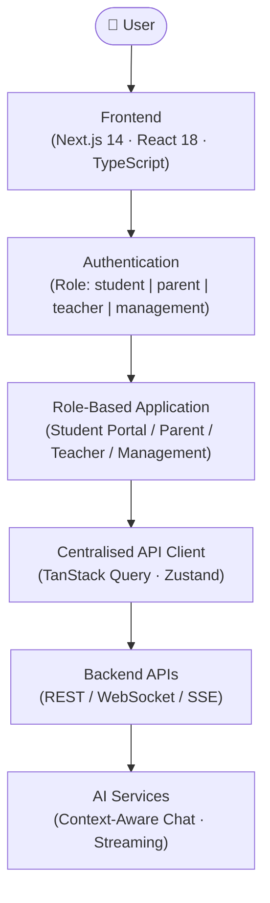
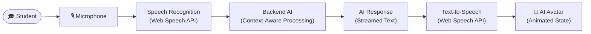
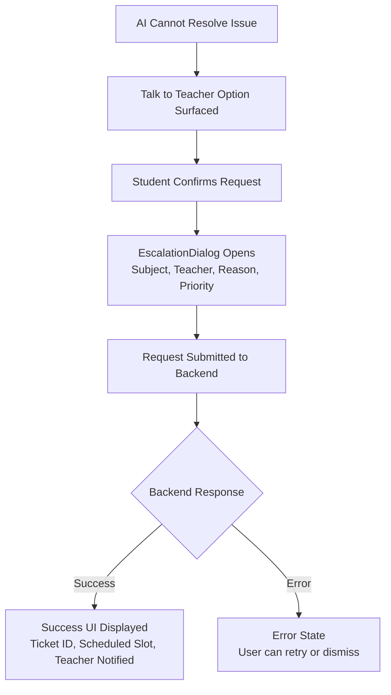

# XYZ AI — Human-Like AI School Assistant

> **AI Assistant · Student Portal · Academic Companion**

XYZ AI is a student-first educational platform that delivers role-specific, intelligent academic experiences for **Students**, **Parents**, **Teachers**, and **School Management**. The primary focus of the product is the student experience — helping every student understand their daily academic status, stay on top of assignments and exams, review their timetable and attendance, and get personalised academic support through a conversational AI companion.

---

## Table of Contents

- [Key Features](#key-features)
- [Technology Stack](#technology-stack)
- [Architecture](#architecture)
- [Application Structure](#application-structure)
- [Component Architecture](#component-architecture)
- [API Integration](#api-integration)
- [Security](#security)
- [Teacher Escalation](#teacher-escalation)
- [Responsive Design](#responsive-design)
- [UX Philosophy](#ux-philosophy)
- [Installation](#installation)
- [Environment Variables](#environment-variables)
- [Development Workflow](#development-workflow)
- [Testing](#testing)
- [Performance](#performance)
- [Accessibility](#accessibility)
- [Project Status](#project-status)
- [Roadmap](#roadmap)
- [Contributing](#contributing)
- [License](#license)

---

## Key Features

### Student Experience

| Feature | Description |
|---|---|
| **Dashboard** | Unified daily overview — attendance, next class, pending work, upcoming exams |
| **Attendance** | Subject-wise and overall attendance with eligibility status and trend awareness |
| **Timetable** | Live daily schedule with current-period and next-period highlighting |
| **Assignments** | Pending, due-soon, completed, and overdue assignment tracking with priority levels |
| **Exams** | Exam schedule, syllabus readiness percentage, countdown, and room details |
| **Performance** | Subject-wise scores, grades, trends, class averages, strengths, and areas to improve |
| **Notifications** | Prioritised alerts for assignments, exams, attendance, and announcements |
| **Study Mode** | AI-driven interactive learning with quiz, explanation, exam prep, and doubt solver modes |

---

### AI Features

| Capability | Details |
|---|---|
| **AI Chat** | Context-aware conversational assistant integrated into the student experience |
| **Streaming Responses** | Word-by-word streamed AI output for a natural, real-time feel |
| **Conversation History** | Persistent chat session within the current context |
| **Contextual Actions** | Dynamic action chips surfaced alongside AI responses for immediate follow-up |
| **Suggested Follow-ups** | AI-generated follow-up question prompts relevant to the current topic |
| **Voice Input** | Microphone-based speech input for hands-free queries |
| **Text-to-Speech** | AI responses delivered as spoken audio output |
| **AI Avatar** | Animated avatar with reactive states: `idle`, `listening`, `thinking`, `speaking`, `happy`, `alert` |
| **Voice Modal** | Full-screen voice interaction panel with audio visualiser |

---

### Study Mode

- **Explain** — Step-by-step concept explanations at beginner, intermediate, or advanced depth
- **Quiz** — Subject-specific multiple-choice quizzes with explanations and difficulty levels
- **Exam Preparation** — Syllabus-aligned revision plans and topic readiness analysis
- **Doubt Solver** — Targeted clarification for specific questions, with teacher escalation fallback

---

### Role-Based Portals

| Role | Experience |
|---|---|
| **Student** | Full AI assistant, attendance, timetable, assignments, exams, performance, study tools |
| **Parent** | Academic overview, attendance visibility, escalation status for their child |
| **Teacher** | Class management, student performance overview, escalation queue |
| **Management** | School-wide analytics, reporting, and administrative oversight |

---

### Multilingual Support

The platform is designed to serve India's linguistically diverse student population.

| Code | Language |
|---|---|
| `en` | English |
| `hi` | Hindi |
| `te` | Telugu |
| `ta` | Tamil |
| `mr` | Marathi |
| `bn` | Bengali |
| `gu` | Gujarati |
| `pa` | Punjabi |
| `kn` | Kannada |
| `ml` | Malayalam |
| `ur` | Urdu |

Language switching is available globally via the Language Selector. Translations are stored in a centralised `translations.ts` module keyed by `LanguageCode`.

---

### Accessibility

The platform is built with accessibility as a first-class concern:

- Semantic HTML throughout
- ARIA labels on all interactive elements
- Full keyboard navigation support
- Screen reader compatibility
- Clearly visible focus states
- Accessible form controls and labels
- Adequate colour contrast in both light and dark themes
- Large, touch-friendly tap targets for mobile users
- `prefers-reduced-motion` support to respect user system preferences
- No reliance on colour alone to convey state

---

### UX States

Every data-driven view handles all possible states — the UI never leaves a user stranded:

| State | Description |
|---|---|
| **Loading** | Spinners and progress indicators during data fetch |
| **Skeleton** | Placeholder layouts while content streams in |
| **Empty** | Friendly empty-state messages with actionable suggestions |
| **Error** | Descriptive error messages with retry options |
| **Success** | Confirmed feedback only after backend acknowledgement |
| **Permission Denied** | Clear role-gating with contextual explanation |
| **Offline** | Graceful degradation with offline-state messaging |

---

## Technology Stack

The following technologies are confirmed in use by the project:

| Category | Technology | Version |
|---|---|---|
| **Framework** | [Next.js](https://nextjs.org/) | `^14.2` |
| **UI Library** | [React](https://react.dev/) | `^18.3` |
| **Language** | [TypeScript](https://www.typescriptlang.org/) | `^5.5` |
| **Styling** | [Tailwind CSS](https://tailwindcss.com/) | `^3.4` |
| **State Management** | [Zustand](https://zustand-demo.pmnd.rs/) | `^4.5` |
| **Server State / Data Fetching** | [TanStack Query (React Query)](https://tanstack.com/query) | `^5.56` |
| **Animation** | [Framer Motion](https://www.framer.com/motion/) | `^11.5` |
| **Charts** | [Recharts](https://recharts.org/) | `^2.12` |
| **Icons** | [Lucide React](https://lucide.dev/) | `^0.441` |
| **Markdown Rendering** | [react-markdown](https://github.com/remarkjs/react-markdown) + remark-gfm | `^9.0` |
| **Utilities** | clsx, tailwind-merge | `^2.x` |

> **Voice & Speech:** Voice interaction is implemented via the browser's native **Web Speech API** (`SpeechRecognition` / `SpeechSynthesis`). No third-party speech SDK is bundled.

> **WebSocket / SSE:** AI response streaming is currently implemented via a simulated word-by-word delivery mechanism. Integration with a live backend streaming endpoint (WebSocket or SSE) is planned for a future phase.

---

## Architecture

### System Overview



### AI Voice Interaction Flow



> **Note:** The architecture diagram represents the intended integration design. The backend AI service and streaming endpoint are pending live integration. Current responses are simulated on the frontend.

---

## Application Structure

The project uses the **Next.js App Router** (`src/app/`). Route segments map directly to user-facing pages.

```
src/app/
├── page.tsx                    # Root redirect → /login or /student
├── layout.tsx                  # Global layout (fonts, providers, theme)
├── globals.css                 # Global Tailwind base styles
│
├── login/                      # Authentication entry point
│
├── student/                    # Primary student experience (AI-first)
│   ├── page.tsx                # Student dashboard
│   ├── chat/                   # AI chat interface with streaming
│   ├── attendance/             # Subject-wise attendance tracker
│   ├── timetable/              # Daily timetable with live period detection
│   ├── assignments/            # Assignment tracker (pending / due / overdue)
│   ├── exams/                  # Exam schedule and preparation status
│   ├── performance/            # Score trends, subject breakdown, comparison
│   ├── study/                  # Study Mode (Explain / Quiz / Exam Prep / Doubt Solver)
│   ├── notifications/          # Notification centre
│   └── voice/                  # Voice interaction entry point
│
├── parent/                     # Parent portal
├── teacher/                    # Teacher portal
├── management/                 # Management / Principal portal
│
└── settings/                   # User settings (theme, language, profile)
```

---

## Component Architecture

Components are organised by responsibility. Reusable components should always be preferred over duplicated UI patterns.

```
src/components/
│
├── ai/                         # AI interaction components
│   ├── AIAvatar.tsx            # Animated avatar with state-reactive expressions
│   ├── AIChat.tsx              # Main chat container (history, streaming, scroll)
│   ├── AudioVisualizer.tsx     # Real-time waveform during voice input
│   ├── ChatInput.tsx           # Text input with voice trigger and send button
│   ├── ChatMessage.tsx         # Individual message bubble (user / AI / system)
│   └── VoiceModal.tsx          # Full-screen voice interaction panel
│
├── cards/                      # Data display cards
│   ├── AssignmentCard.tsx      # Single assignment with status, priority, due date
│   ├── AttendanceCard.tsx      # Subject attendance with percentage and status
│   ├── ExamCard.tsx            # Exam detail with countdown and readiness
│   ├── QuickActions.tsx        # AI-suggested contextual action chips
│   └── TimetableCard.tsx       # Single timetable period with current/next state
│
├── dialogs/                    # Modal dialogs
│   ├── EscalationDialog.tsx    # Teacher callback request flow
│   └── LanguageSelectorModal.tsx # 11-language selector modal
│
└── layout/                     # Shell and navigation components
    ├── AppHeader.tsx           # Top navigation bar (role switcher, notifications, theme)
    ├── MobileNav.tsx           # Bottom navigation bar for mobile devices
    ├── NotificationDropdown.tsx # Notification panel with unread count
    ├── RoleSwitcherModal.tsx   # Role-switching modal (dev/demo tool)
    └── Sidebar.tsx             # Desktop sidebar navigation
```

---

## API Integration

The frontend uses a **centralised `ApiClient` class** (`src/lib/api/client.ts`) as the single point of communication with the backend. All data fetching goes through this client; no component makes direct HTTP calls.

### API Categories

| Category | Methods |
|---|---|
| **Attendance** | `getAttendanceSummary()`, `getSubjectAttendance()` |
| **Timetable** | `getTimetable(day)` |
| **Assignments** | `getAssignments()` |
| **Exams** | `getExams()` |
| **Performance** | `getPerformance()` |
| **Notifications** | `getNotifications()` |
| **Study / Quiz** | `getQuizQuestions(subject?)` |
| **AI Chat** | `streamAIChat(prompt, onChunk, onComplete)` |
| **Escalation** | `requestTeacherEscalation(data)` |

> **Current state:** The API client returns mock data from `src/lib/api/mockData.ts` with simulated network latency. The client is structured so that live HTTP/WebSocket calls can replace the mock implementations without changing any call sites.

> **Configuration:** The base URL is read from `NEXT_PUBLIC_API_URL`. When this variable is not set, the client operates in mock mode.

### Authorization Boundary

> ⚠️ **The frontend must not make security or authorization decisions independently.**
> Backend authorization is always authoritative. Frontend role checks exist only to render the correct UI — they are never a substitute for server-side access control.

---

## Security

| Requirement | Rule |
|---|---|
| **API Keys** | Never expose API keys in frontend source code or environment variables committed to source control |
| **Secret Tokens** | Never expose secret or service-account tokens client-side |
| **System Prompts** | Never expose AI system prompts or model configuration in the frontend |
| **Sensitive Credentials** | Never store passwords, private keys, or session secrets in frontend code |
| **Frontend Permissions** | Frontend role checks are for UX only. Backend must enforce all access control |
| **Premature Success** | Never display a success confirmation before the backend has confirmed the operation |
| **Secret Management** | Use `.env.local` for local secrets. Never commit `.env.local` to version control |

---

## Teacher Escalation

When the AI cannot resolve a student's issue, the platform provides a structured teacher escalation flow. The UI must never confirm success before the backend acknowledges the request.



The `EscalationRequest` lifecycle: `submitted` → `acknowledged` → `scheduled` → `resolved`.

---

## Responsive Design

XYZ AI is designed **mobile-first**. The mobile layout is not a scaled-down desktop — it is the primary design surface.

### Mobile — Primary Student Experience

- Single-column layout
- Bottom navigation bar (`MobileNav`) for thumb-friendly access
- Full-screen voice modal
- Touch-optimised tap targets (minimum 44 × 44 px)
- Minimal chrome; maximum content

### Tablet — Dual-Column Layouts

- Two-column card grids where content density benefits from wider viewports
- Sidebar navigation may appear at this breakpoint

### Desktop — Expanded Dashboard & Analytics

- Persistent sidebar navigation
- Multi-column dashboard with richer data tables and charts
- Expanded performance analytics with Recharts visualisations
- Wider AI chat panel with contextual action sidebars

---

## UX Philosophy

XYZ AI applies a strict UX priority order:

```
UX → Accessibility → Performance → Simplicity → Visual Quality
```

Every UI decision should be evaluated against one question:

> **Does this help the student accomplish something faster and with less confusion?**

Principles:

- Prefer progressive disclosure — show what the student needs, when they need it
- Never block the student with unnecessary modals or confirmations
- AI responses must feel like a conversation, not a search result
- Empty states must suggest a next action — never leave a dead end
- Error states must be specific and recoverable
- Loading states must be instant-feeling (skeleton loaders, not blank screens)
- Animations must add meaning, not noise (`prefers-reduced-motion` respected)

---

## Installation

> **Prerequisites:** [Node.js](https://nodejs.org/) (v18 or later recommended), npm or an equivalent package manager.

```bash
# 1. Clone the repository
git clone <repository-url>
cd xyz-ai-frontend

# 2. Install project dependencies
npm install

# 3. Start the development server
npm run dev
```

The development server starts at `http://localhost:3000` by default.

### Available Scripts

| Script | Command | Description |
|---|---|---|
| Development | `npm run dev` | Starts the Next.js dev server with hot reload |
| Build | `npm run build` | Creates an optimised production build |
| Start | `npm run start` | Runs the production build locally |
| Lint | `npm run lint` | Runs Next.js ESLint checks |

---

## Environment Variables

```env
# --- Backend -------------------------------------------------------------------
# Base URL for all API requests. When unset, the client runs in mock-data mode.
NEXT_PUBLIC_API_URL=

# --- Add project-specific environment variables below -------------------------
# Never commit secret values. Use .env.local for local development secrets.
```

> **Secret credentials must always remain server-side.** The `NEXT_PUBLIC_` prefix exposes a variable to the browser bundle. Only use it for non-sensitive, public configuration values such as API base URLs.

Copy `.env.local.example` to `.env.local` (if provided) and fill in the values before starting the server.

---

## Development Workflow

The following is the recommended workflow for setting up and developing XYZ AI:

1. **Install dependencies** — `npm install`
2. **Configure environment variables** — create `.env.local` with required values
3. **Start the development server** — `npm run dev`
4. **Connect to backend APIs** — update `NEXT_PUBLIC_API_URL` and replace mock implementations in `src/lib/api/client.ts`
5. **Test authentication** — verify login flow and session handling for all roles
6. **Test role-based access** — confirm each role sees only its intended portal and data
7. **Test AI chat** — verify streaming, contextual actions, follow-up suggestions, and error handling
8. **Test voice interaction** — verify microphone permissions, speech recognition, and TTS output
9. **Test responsive layouts** — validate on mobile (375px), tablet (768px), and desktop (1280px+)
10. **Test accessibility** — run keyboard navigation and screen reader checks
11. **Test UX states** — verify loading, skeleton, empty, error, success, permission-denied, and offline states
12. **Build for production** — `npm run build` and confirm zero TypeScript/lint errors

---

## Testing

XYZ AI requires thorough testing across the following dimensions. The project does not currently prescribe a specific testing framework — teams should adopt tooling that fits their CI pipeline.

| Test Area | What to Verify |
|---|---|
| **UI / Component** | Components render correctly for all data states |
| **Responsive** | Layouts are correct at mobile, tablet, and desktop breakpoints |
| **Accessibility** | Keyboard navigation, ARIA labels, screen reader output, contrast |
| **Authentication** | Login flow, session persistence, redirect on expiry |
| **Role-Based Access** | Each role sees only its designated portal and data |
| **API Integration** | All API client methods return expected data shapes |
| **AI Chat** | Streaming works correctly; contextual actions trigger correct prompts |
| **Voice** | Microphone permission, speech recognition accuracy, TTS output |
| **Error States** | API failures show descriptive errors with retry options |
| **Offline** | Graceful degradation when network is unavailable |

---

## Performance

| Goal | Approach |
|---|---|
| **Fast initial load** | Code splitting by route (Next.js App Router default); minimal global bundle |
| **Small bundle size** | Avoid unnecessary dependencies; prefer tree-shakeable libraries |
| **Optimised images** | Use Next.js `<Image>` component with appropriate sizing and formats |
| **Efficient API requests** | TanStack Query caching and deduplication; avoid redundant fetches |
| **AI streaming** | Word-by-word rendering keeps Time-to-First-Byte perception low |
| **Rendering efficiency** | Zustand selector-based subscriptions prevent unnecessary re-renders |
| **Mobile performance** | Reduced animation complexity on low-end devices; `prefers-reduced-motion` respected |
| **Lazy loading** | Heavy routes and components loaded on demand |

---

## Accessibility

### Checklist

- [x] Semantic HTML elements (`<main>`, `<nav>`, `<header>`, `<section>`, `<article>`, `<button>`)
- [x] All interactive elements have descriptive `aria-label` or `aria-labelledby`
- [x] Full keyboard navigation (Tab, Shift+Tab, Enter, Escape, Arrow keys)
- [x] Screen reader compatibility — meaningful reading order and live regions
- [x] Visible `:focus-visible` states on all focusable elements
- [x] Accessible form controls with associated `<label>` elements
- [x] Adequate colour contrast — minimum WCAG AA (4.5:1 for text, 3:1 for UI components)
- [x] Touch targets meet minimum 44 × 44 CSS pixel size
- [x] `prefers-reduced-motion` media query respected in all animations
- [x] State and status never communicated by colour alone

---

## Project Status

```
[x] Project architecture defined (Next.js App Router, component-based)
[x] Technology stack confirmed (Next.js 14, React 18, TypeScript 5, Tailwind CSS 3)
[x] State management implemented (Zustand store with full AppState)
[x] Centralised API client implemented (mock-data mode, ready for backend swap)
[x] Multilingual translation system implemented (11 languages)
[x] Student-first UX structure defined and scaffolded
[x] Role-based routing implemented (student / parent / teacher / management)
[x] AI chat with streaming implemented (simulated; backend integration pending)
[x] AI avatar with reactive states implemented
[x] Voice modal and audio visualiser implemented
[x] Teacher escalation dialog implemented (UI + mock backend confirmation)
[x] Core student routes scaffolded (dashboard, attendance, timetable, assignments, exams, performance, study, notifications)
[x] Study Mode implemented (Explain, Quiz, Exam Prep, Doubt Solver)
[x] Dark / light theme toggle implemented
[ ] Live backend API integration
[ ] Production authentication (JWT / OAuth / SSO)
[ ] Parent portal full implementation
[ ] Teacher portal full implementation
[ ] Management portal full implementation
[ ] Real-time WebSocket / SSE AI streaming
[ ] Backend Speech-to-Text integration
[ ] Backend Text-to-Speech integration
[ ] Production deployment
[ ] Full accessibility audit
[ ] End-to-end test coverage
```

---

## Roadmap

### Phase 1 — Foundation *(Scaffolded)*

- [x] Next.js App Router project setup
- [x] TypeScript strict configuration
- [x] Tailwind CSS design system
- [x] Zustand global state store
- [x] TanStack Query integration
- [x] Centralised API client
- [x] Multilingual i18n system
- [x] Role-based routing structure

### Phase 2 — Student Experience *(UI Implemented, Backend Pending)*

- [x] Student dashboard
- [x] Attendance tracker (subject-wise + overall)
- [x] Daily timetable with live period detection
- [x] Assignment tracker with priority and status
- [x] Exam schedule with readiness percentage
- [x] Performance charts and trend analysis
- [x] Notification centre

### Phase 3 — AI *(Simulated, Live Integration Pending)*

- [x] AI chat interface
- [x] Word-by-word streaming simulation
- [x] Conversation history within session
- [x] Context-aware response routing
- [x] Contextual action chips
- [x] Suggested follow-up questions
- [ ] Live backend AI streaming (WebSocket / SSE)
- [ ] Persistent cross-session conversation history

### Phase 4 — Voice & Avatar *(Web Speech API Implemented)*

- [x] Voice input (Web Speech API SpeechRecognition)
- [x] Text-to-speech output (Web Speech API SpeechSynthesis)
- [x] Animated AI avatar with reactive states
- [x] Full-screen voice modal with audio visualiser
- [x] Voice state machine (idle → listening → processing → speaking → error)
- [ ] Backend STT/TTS integration for production reliability
- [ ] Multi-language voice input

### Phase 5 — Role-Based Portals *(Scaffolded, In Progress)*

- [x] Role switcher and routing
- [ ] Parent portal — full data integration
- [ ] Teacher portal — class management, escalation queue
- [ ] Management portal — school-wide analytics

### Phase 6 — Quality *(Ongoing)*

- [ ] Full WCAG accessibility audit
- [ ] Automated accessibility tests
- [ ] Lighthouse performance targets (LCP < 2.5s, CLS < 0.1)
- [ ] End-to-end test suite
- [ ] Comprehensive error handling coverage
- [ ] Offline support and service worker
- [ ] Production deployment pipeline

---

## Contributing

Contributions are welcome. Please follow these guidelines to maintain code quality:

1. **Branch** — Create a feature branch from `main`: `git checkout -b feature/your-feature-name`
2. **TypeScript** — Use TypeScript strictly. No `any` types without explicit justification. Define interfaces in `src/types/`.
3. **Components** — Build reusable components. Check `src/components/` before creating new ones. Do not duplicate UI logic.
4. **Conventions** — Follow existing naming, file structure, and import conventions in the codebase.
5. **Dependencies** — Do not add dependencies without justification. Prefer libraries already in use.
6. **State** — Use the Zustand store (`useAppStore`) for global state. Use TanStack Query for server state. Use local `useState` for ephemeral UI state.
7. **Accessibility** — Every new component must meet the accessibility checklist. Run keyboard navigation checks before submitting.
8. **Responsive** — Test all new UI at mobile (375px), tablet (768px), and desktop (1280px) breakpoints.
9. **Test** — Manually verify loading, error, and empty states for all new data-driven views.
10. **Secrets** — Never commit API keys, tokens, or credentials. Use `.env.local` and confirm `.gitignore` covers it.
11. **Pull Request** — Write a clear PR description explaining what changed and why. Link to any relevant issues.

---

## License

> License information will be added by the project maintainers.
# xyz-ai-frontend

